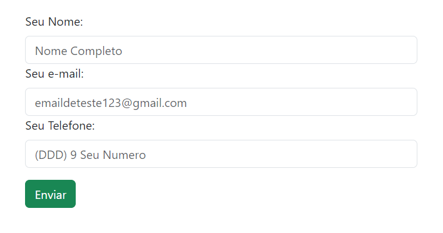

### Bootstrap Atividade

## Requisitos

-  Adicionar o Bootstrap em uma página HTML utilizando a CDN;

-  Nesta página HTML, crie um formulário de cadastro que deverá conter os campos: nome, e-mail e telefone, e um botão para o envio;

-  Aplique as classes do Bootstrap nos elementos do formulário;

## Sobre
- Adicionei também máscara nos campos e validações com jQuery para melhor usabilidade dando feedback dos inputs preenchidos para usuário.

- Input corretamente preenchidos recebe verificado indicando ao usuário que está validado.

- O formulário esta disponível para dispositivos moveis sendo responsivo a computadores, tablet e celulares

##

Clique para ver 👇

    <a href="https://ebac-modulo-bootstrap-atividade.vercel.app/">
        </img>
    </a>

